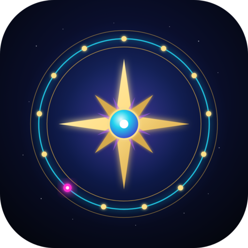

# ✦ Tarot 13 ✦
## The 13-Sign Celestial Tarot

**78 cards. 13 signs. The constellations tell the story.**

*This deck uses upright-only readings. Reversals are not required. Every card contains both constructive and challenging expressions, and the spread determines which aspect comes forward.*

A 78-card tarot of the actual constellations. The familiar tarot skeleton (22 Majors, 56 Minors) stays intact; underneath runs a 13-sign celestial system with ⛎ Ophiuchus as the 9th sign. Drawn as glowing neon star maps on deep black with gold filigree.

📖 **The full design spec is the [Deck Bible](docs/deck-bible.md).** Spreads are in the [Spreads guide](docs/spreads.md).


> **Shuffle & draw:** the live app is at **https://lezkt1811-maker.github.io/Tarot13/** (source: [`index.html`](index.html)).
>
> Mockup preview: open [`mockups/index.html`](mockups/index.html), or turn on GitHub Pages to view it online.

---

## The deck at a glance

| Part | Cards | Sky mapping |
|---|---|---|
| **Major Arcana** | 22 | The 10 planets/luminaries and the 12 zodiac constellations |
| **Pips (Ace–9)** | 36 | Extra-zodiacal constellations (e.g. Five of Cups = **Ophiuchus**, the 13th sign) |
| **Tens** | 4 | Raw elemental force: Fire, Water, Air, Earth |
| **Court cards** | 16 | Page · Knight · Queen · King (no extra Ophiuchus court) |

### Suits
| Suit | Element | Neon glow |
|---|---|---|
| Wands | Fire | Magenta `#FF2ED1` |
| Cups | Water | Cyan `#22D3EE` |
| Swords | Air | Electric blue `#2563FF` |
| Pentacles | Earth | Violet `#A855F7` (with gold coins) |
| Major Arcana | Spirit | Full blue→magenta gradient + gold glyph |

The full card-by-card list is in [`data/cards.csv`](data/cards.csv), [`data/cards.json`](data/cards.json), and the editable spreadsheet [`data/Tarot-13_Master_List.xlsx`](data/Tarot-13_Master_List.xlsx).

---

## Upright-only readings

> **This deck uses upright-only readings. Reversals are not required. Every card contains both constructive and challenging expressions, and the spread determines which aspect comes forward.**

- Every card has **one core meaning** (see `core_meaning` in the card data). There are no reversed meanings.
- Cards are never read upside down, and the shuffles never turn cards over.
- The reading decides which aspect of a card's meaning comes forward, from three things: **the question asked**, **the card's position in the spread**, and **the surrounding cards**.

| Aspect | What it means in a reading |
|---|---|
| **Constructive** | The card's energy is working in your favor |
| **Challenging** | The card's energy asks for effort or brings difficulty |
| **Blocked** | The energy is present but held back, not yet flowing |
| **Excessive** | Too much of this energy: a strength overused |
| **Internal** | The energy is unfolding inside you rather than in events |
| **Warning** | A caution about where things are heading |

Rules of thumb used by the reader:
- **Position:** advice and support positions bring a card's constructive side forward; challenge and obstacle positions bring its challenging side (a bright card there reads as *excessive*); "what is blocking you" reads as *blocked*; hidden and healing positions read as *internal*; outcome positions turn into a *warning* when the spread leans heavy.
- **Surrounding cards:** a card flanked by difficult cards takes on their weight; one suit flooding the spread makes that element *excessive*.
- **The question:** a question about being stuck draws out *blocked* aspects; questions about feelings draw out *internal* ones; "should I" and risk questions bring *warnings* forward.

---

## The 13-sign spine

♈ Aries *birth of action* → ♉ Taurus *embodiment* → ♊ Gemini *mind* → ♋ Cancer *feeling* → ♌ Leo *self-expression* → ♍ Virgo *discernment* → ♎ Libra *relationship* → ♏ Scorpio *death / transformation* → **⛎ Ophiuchus** ***healing / regeneration*** → ♐ Sagittarius *meaning / expansion* → ♑ Capricorn *structure* → ♒ Aquarius *liberation* → ♓ Pisces *dissolution / transcendence*

**Scorpio ends. Ophiuchus heals. Sagittarius rises.**

Every numbered card encodes: number → suit / element → 13-sign position → decan → constellation → myth → meaning.

---

## ⛎ Signature card: Five of Cups, The Healer

The heart of Tarot 13. Ophiuchus, the Serpent Bearer and often called the "13th sign," appears as the **Five of Cups**. In the Celestial Tarot framework it is an extra-zodiacal constellation sitting in the 2nd decan of Scorpio, not a zodiac sign. Tarot 13 honors it as the 13th: the deck's featured card, the 13-pile deal, and the Ophiuchus seat in the 13-card wheel spread. It depicts Asclepius, the Greek god of healing.

| | |
|---|---|
| Constellation | Ophiuchus / Asclepius |
| Decan | 2nd decan of Scorpio |
| Decan ruler | Neptune |
| Harmonic | Quintile |

**Theme:** healing what was lost. *"What was broken is not necessarily lost."*

**Constructive expression:** something damaged can be healed. **Challenging expression:** trying to resurrect something that has already completed its purpose. The spread decides which comes forward.

Ophiuchus does not replace any Major Arcana card and has no extra court card. Its power enters the deck through the Five of Cups.

**Ophiuchus visual language:** serpent, staff, healing hands, herbs, wounded → restored imagery, Scorpio descending and Sagittarius rising. Electric cyan, violet, hot magenta and luminous white on black, with restrained gold. The serpent is celestial and intelligent, never horror.

---

## Repository layout

```
art/
  backs/       card-back designs (v2 = current official back)
  major/       22 Major Arcana finals
  wands/  cups/  swords/  pentacles/   pip cards Ace–10
  courts/      16 court cards
data/          master card list (CSV, JSON, XLSX)
design/        style guide: palette, frame, typography
mockups/       early HTML/SVG mockups (The Fool + card back)
```

### File naming
Use lowercase with dashes, zero-padded so files sort in deck order:

- Majors: `art/major/00-the-fool.png`, `art/major/13-death.png`, `art/major/21-the-world.png`
- Pips: `art/cups/05-five-of-cups.png`
- Courts: `art/courts/wands-queen.png`

---

## Progress

- [x] Framework and 78-card correspondence list
- [x] Style direction (BlueNeon palette + gold)
- [x] Card back v1 (neon + gold zodiac wheel)
- [x] Card back v2, **official** (all-gold celestial)
- [x] The Fool mockup
- [ ] Final card frame template
- [ ] 22 Major Arcana
- [ ] 40 pips
- [ ] 16 courts
- [ ] Guidebook text
- [ ] Print-ready files (300 DPI + bleed)

## How the deck is mapped
Every pip (Ace–9) sits on one **decan**, a 10° slice of the zodiac. Each suit runs through its element's three signs in order: cardinal (Ace–3), fixed (4–6), mutable (7–9). Each decan carries a traditional extra-zodiacal constellation. Tens are the element's trinity of all three signs.

| Suit | Ace–3 | 4–6 | 7–9 |
|---|---|---|---|
| Wands | Aries | Leo | Sagittarius |
| Cups | Cancer | Scorpio | Pisces |
| Swords | Libra | Aquarius | Gemini |
| Pentacles | Capricorn | Taurus | Virgo |

Each pip's harmonic follows its number (Ace = conjunction, 5 = quintile, 9 = novile). Decan rulers follow the modern triplicity system. Example: Five of Cups = 2nd decan Scorpio, ruled by Neptune.

## Source check
The **Source check** column in the data marks each card:
- **Confirmed (13):** stated in [Brian Clark's own text](https://www.astrosynthesis.com.au/wp-content/uploads/2017/11/The-Celestial-Tarot-Brian-Clark.pdf).
- **Derived (31):** filled from the decan pattern above, which matches every confirmed card.
- **Unverified (34):** Majors VI–XXI, Tens and court cards, from the original Google list. The Swords Queen (Aquarius) and King (Libra) were corrected to fit the pattern.

---

## Credits & rights
The astrological correspondence framework follows the tradition used in *Celestial Tarot* (Kay Steventon & Brian Clark, U.S. Games Systems). **All artwork, card designs, and text in this repository are original to Tarot 13.**

© 2026 lezkt1811-maker. All rights reserved. Artwork may not be reproduced or sold without permission.
