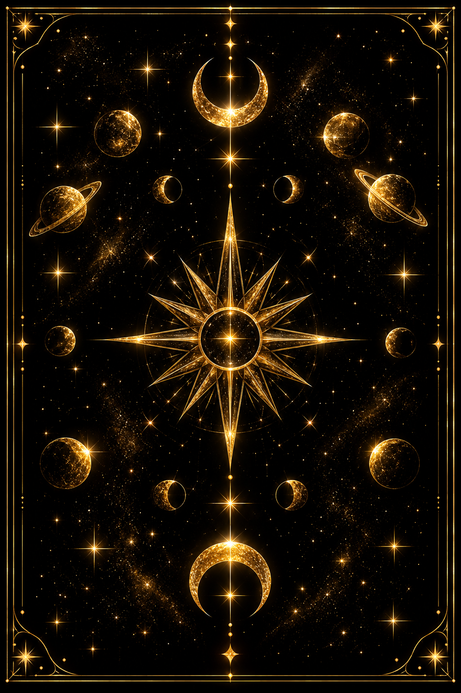

# ✦ Tarot 13 ✦

**A neon + gold celestial tarot deck.** 78 cards mapped to the night sky (planets, zodiac signs, and constellations), drawn as glowing star maps on deep black with gold filigree.



> Mockup preview: open [`mockups/index.html`](mockups/index.html), or turn on GitHub Pages to view it online.

---

## The deck at a glance

| Part | Cards | Sky mapping |
|---|---|---|
| **Major Arcana** | 22 | The 10 planets/luminaries and the 12 zodiac constellations |
| **Pips (Ace–9)** | 36 | Extra-zodiacal constellations (e.g. Five of Cups = **Ophiuchus**, the 13th sign) |
| **Tens** | 4 | Raw elemental force: Fire, Water, Air, Earth |
| **Court cards** | 16 | Princess = season · Prince = mutable sign · Queen = fixed sign · King = cardinal sign |

### Suits
| Suit | Element | Neon glow |
|---|---|---|
| Wands | Fire | Magenta `#FF2ED1` |
| Cups | Water | Cyan `#22D3EE` |
| Swords | Air | Electric blue `#2563FF` |
| Pentacles | Earth | Violet `#A855F7` (with gold coins) |
| Major Arcana | Spirit | Full blue→magenta gradient + gold glyph |

The full card-by-card list is in [`data/cards.csv`](data/cards.csv), [`data/cards.json`](data/cards.json), and the editable spreadsheet [`data/Tarot-13_Master_List.xlsx`](data/Tarot-13_Master_List.xlsx).

---

## Repository layout

```
art/
  backs/       card-back designs (v2 = current official back)
  major/       22 Major Arcana finals
  wands/  cups/  swords/  pentacles/   pip cards Ace–10
  courts/      16 court cards
data/          master card list (CSV, JSON, XLSX)
design/        style guide: palette, frame, typography
mockups/       early HTML/SVG mockups (The Fool + card back)
```

### File naming
Use lowercase with dashes, zero-padded so files sort in deck order:

- Majors: `art/major/00-the-fool.png`, `art/major/13-death.png`, `art/major/21-the-world.png`
- Pips: `art/cups/05-five-of-cups.png`
- Courts: `art/courts/wands-queen.png`

---

## Progress

- [x] Framework and 78-card correspondence list
- [x] Style direction (BlueNeon palette + gold)
- [x] Card back v1 (neon + gold zodiac wheel)
- [x] Card back v2, **official** (all-gold celestial)
- [x] The Fool mockup
- [ ] Final card frame template
- [ ] 22 Major Arcana
- [ ] 40 pips
- [ ] 16 courts
- [ ] Guidebook text
- [ ] Print-ready files (300 DPI + bleed)

## Open questions
The card list started from a Google AI summary, which turned out to be wrong in places. The **Source check** column in the data marks each card:

- **Confirmed (13):** Majors 0–V, Ace of Cups (Ursa Minor), Two of Swords (Lupus), Eight of Wands (Ara), Ace of Swords (Crux), Five of Cups (Ophiuchus), Eight of Pentacles (Centaurus), Nine of Cups (Andromeda). Source: [Brian Clark, *The Celestial Tarot*](https://www.astrosynthesis.com.au/wp-content/uploads/2017/11/The-Celestial-Tarot-Brian-Clark.pdf).
- **Conflicts (2):** Six of Swords and Nine of Swords were listed as Ursa Minor and Lupus, which are now confirmed elsewhere. Their real constellations are unknown.
- **Unverified (63):** everything else, including Ace of Pentacles = Sagitta and the Swords Queen/King (Libra/Aquarius, possibly swapped).
- **To do:** check the rest against the Celestial Tarot guidebook.
- **Card back v2:** the ringed planets appear only in the top half, so the back isn't identical upside down. Make the lower planets ringed too if reversals must stay hidden.

---

## Credits & rights
The astrological correspondence framework follows the tradition used in *Celestial Tarot* (Kay Steventon & Brian Clark, U.S. Games Systems). **All artwork, card designs, and text in this repository are original to Tarot 13.**

© 2026 lezkt1811-maker. All rights reserved. Artwork may not be reproduced or sold without permission.
